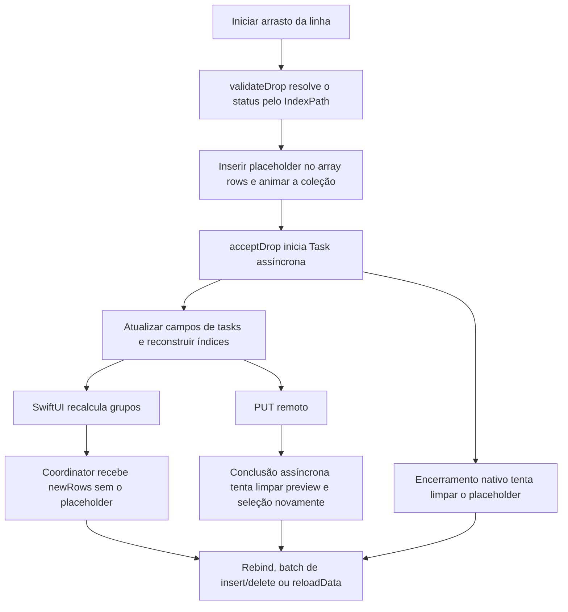
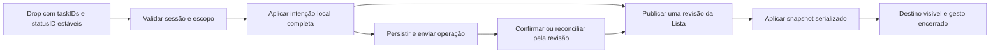

# Apollo — análise de desempenho e plano de otimização

> Continuação em 08/09/2026: Marconi autorizou implementar uma candidata **DEV-01**. O código e a validação estão no [relatório de implementação](/Users/marconi/Documents/PROJETOS/CLOUDE/daypanel-swift-dev-01/docs/dev-01/README.md), branch `dev/01-optimization`, commit `cd52667400cfa864944f701dc7554fa8368ecc37`. O layout vigente passou a ser **+ Evento · + Tarefa** à esquerda e **Minhas tarefas** à direita; raio lateral menor no macOS 27 e recuo adicional de 15 px nos traffic lights. O restante deste documento preserva a análise original e suas propostas, não o estado de aceite da candidata.

Data: 08/09/2026. Escopo solicitado: diagnóstico e planejamento, sem implementar as correções ou publicar uma versão.

O problema prioritário é a **Lista agrupada por status**, conforme esclarecido por Marconi: glitches ao soltar uma tarefa em um status vazio e tarefas que só aparecem no destino depois de sair e voltar à tela.

Escopo adicional solicitado durante a análise: toggle **“Minhas tarefas”** na barra superior da Lista e do Quadro, ligado ao filtro existente de responsável; botão de nova tarefa reduzido ao ícone `+`.

## Conclusão

Há dois trabalhos complementares: estabilizar a transição entre gesto, modelo e coleção nativa; reduzir o trabalho executado a cada mudança de tarefa. O Apollo já atualiza o status localmente antes de aguardar o servidor. Portanto, acrescentar outra atualização otimista ou aumentar a frequência do polling não resolve, por si só, o problema relatado.

A hipótese principal para o glitch é a coexistência de atualizações independentes sobre as mesmas linhas da `NSCollectionView`: o preview de arrasto altera o array da coleção, o SwiftUI publica uma nova projeção que exclui esse preview, e o encerramento do gesto também tenta removê-lo. Movimentos entre grupos ainda podem cair em `reloadData()`. Essa combinação está demonstrada no código; sua responsabilidade pelo sintoma visual específico ainda exige um trace do gesto.

Um gargalo já foi confirmado executando o modelo real: uma mudança de status provoca **três reconstruções completas dos índices**, porque cada campo da tarefa é escrito separadamente no array `@Published`. Mover 50 tarefas resulta em 150 reconstruções, mesmo dentro de um único bloco `MainActor.run`.

## 1. Fonte correta e limites da análise

| Componente | Estado verificado |
| --- | --- |
| Checkout da distribuição | `/Users/marconi/Apollo`, `main`, `698816f` |
| Código correspondente à linha 1.9.9 | `/Users/marconi/Documents/PROJETOS/CLOUDE/daypanel-swift`, `redesign/editorial-plus`, `dcf22830944bbe93f6787a08eff3c90077b4d2d8` |
| Aplicativo instalado e em execução | `/Applications/Apollo.app`, versão 1.9.9, build 97 |
| ReviewKit usado pelo código | Dependência local `../apollo-review-swift` |
| Ferramentas utilizadas | Xcode 26.6, Apple Swift 6.3.3; pacote em modo Swift 5.9, mínimo macOS 14 |

A `main` não contém a implementação mais recente da interface. Futuras mudanças devem partir da branch `redesign/editorial-plus`, em checkout isolado, preservando os arquivos locais preexistentes. O número de versão e a estrutura do executável ligam essa branch à linha instalada, mas não foi encontrada nesta auditoria uma identificação de commit embutida no binário que comprove equivalência byte a byte.

Foram examinados o fluxo da Lista, a implementação do Quadro relacionada, sincronização, modelo de tarefas, fila offline, cache em disco, imagens, observação de reviews/mídia e trechos de calendário e IA que propagam atualizações à interface. O inventário de `Sources` contém 151 arquivos Swift e 82.154 linhas; isso é o tamanho do código, não uma alegação de leitura integral de todos os arquivos.

Evidências executadas:

- 28 testes existentes de invariantes de desempenho, filtros e seleção: passaram.
- 4 testes diagnósticos adicionais: passaram. Usam o `AppState` real com dados sintéticos locais e não chamam as APIs de mutação ou `initialize()`.
- Amostragem passiva de 8 segundos do aplicativo instalado, solicitado intervalo de 10 ms.
- Inspeção da janela via acessibilidade e inventário de cache apenas por tamanho/contagem.
- Consulta às referências oficiais Apple e ClickUp para os critérios técnicos do plano.

Não foi executado drag-and-drop que modificasse tarefas reais. Não há ainda trace de Instruments durante a falha, medição de FPS/p95/p99 da versão Release, perfil de energia ou diagnóstico de vazamento de memória. O relato do usuário é evidência do sintoma; os testes de modelo não substituem sua reprodução visual.

## 2. O caminho atual do gesto

Os caminhos relevantes estão em [MyTasksAppKitList.swift](/Users/marconi/Documents/PROJETOS/CLOUDE/daypanel-swift/Sources/DayPanel/Views/Home/MyTasksAppKitList.swift:317), [EditorialMyTasksView.swift](/Users/marconi/Documents/PROJETOS/CLOUDE/daypanel-swift/Sources/DayPanel/Views/Home/EditorialMyTasksView.swift:207) e [AppState.swift](/Users/marconi/Documents/PROJETOS/CLOUDE/daypanel-swift/Sources/DayPanel/ViewModels/AppState.swift:3526).

## 3. Achados prioritários

### A01 — Preview e conteúdo disputam a mesma coleção

**Prioridade P0. Estrutura confirmada; causalidade visual ainda é hipótese forte.**

`showDropPreview` insere uma linha em `rows` dentro de `validateDrop`. `clearDropPreview` a remove. Porém `update(parent:)` também substitui `rows` por `flatten(parent.sections)`, que nunca inclui o preview. Não existe uma fila única de transições, geração aplicada ou proteção explícita contra nova atualização enquanto um batch está em andamento.

O callback da origem encerra o preview em `configure(...).onEndDrag`; a tarefa assíncrona de `acceptDrop` faz isso novamente depois do servidor. Como callbacks e arrays mudam em tempos diferentes, o `IndexPath` usado para decidir o destino pode descrever uma projeção diferente. Em grupos vazios, a introdução do preview muda a geometria da única área de destino, o cabeçalho.

**Proposta:** estado explícito de sessão de arrasto, destino identificado por lista + status e um único responsável por aplicar mudanças à coleção. O indicador de destino deve preferencialmente ser um overlay sem alterar a contagem de itens durante `validateDrop`. Resolver o destino antes de mudar a apresentação. Encerrar estado visual uma única vez; a resposta da rede não deve controlar a vida do gesto.

Fonte: [preview e delegates](/Users/marconi/Documents/PROJETOS/CLOUDE/daypanel-swift/Sources/DayPanel/Views/Home/MyTasksAppKitList.swift:532).

### A02 — Mover tarefas pode reconstruir toda a coleção

**Prioridade P0. Caminho confirmado; vínculo com desaparecimento ainda requer reprodução.**

`update(parent:)` anima inserções/exclusões somente se os identificadores sobreviventes mantiverem a mesma ordem. Uma tarefa que cruza o cabeçalho de outro status altera essa ordem e pode cair no `reloadData()`. A alternativa de rebind atual atualiza somente células cujo tipo já corresponde à linha; um tipo divergente é ignorado pelos casts opcionais.

Há guardas que devolvem uma célula de placeholder quando o índice está fora do array durante uma consulta da coleção. Elas evitam um acesso inválido, mas não constituem uma prova de consistência entre modelo, índices e células exibidas.

**Proposta:** aplicar um snapshot coerente com identidades estáveis para seções e tarefas, suportando movimentos e atualização de conteúdo. Preferência por `NSCollectionViewDiffableDataSource` com aplicação serializada; validar antes a geometria e o comportamento no macOS mínimo suportado. Manter o renderer AppKit reciclável existente. Não usar reconstrução da tela, `.id(UUID())`, atrasos artificiais ou `reloadData()` como correção de movimento comum.

Fontes: [escolha de atualização](/Users/marconi/Documents/PROJETOS/CLOUDE/daypanel-swift/Sources/DayPanel/Views/Home/MyTasksAppKitList.swift:327), [células](/Users/marconi/Documents/PROJETOS/CLOUDE/daypanel-swift/Sources/DayPanel/Views/Home/MyTasksAppKitList.swift:387).

### A03 — Atualização em lote não é uma única publicação

**Prioridade P0. Confirmado por execução do modelo real.**

`tasks` possui `didSet { rebuildTaskIndex() }`. `applyStatusToMirrors` escreve `status`, `statusColor` e `isCompleted` separadamente. Cada escrita reconstrói mapas, partições, contadores, ordenação e cache de subtarefas. O procedimento se repete para cada tarefa do lote. Coalescer renders no SwiftUI não elimina esse trabalho síncrono nem as emissões do Combine.

O ensaio mediu apenas o caminho de escrita de `tasks`, sem outros espelhos, filtros da tela, desenho, rede ou rollback:

| Tarefas no modelo | Tarefas alteradas | Reconstruções atuais | Emissões de `objectWillChange` | Tempo atual, Debug | Cópia + publicação única, Debug |
| ---: | ---: | ---: | ---: | ---: | ---: |
| 132 | 1 | 3 | 27 | 1,80 ms | 0,58 ms |
| 132 | 10 | 30 | 270 | 17,30 ms | 0,57 ms |
| 1.000 | 1 | 3 | 27 | 21,17 ms | 7,01 ms |
| 1.000 | 50 | 150 | 1.350 | 1.027,26 ms | 6,66 ms |
| 5.000 | 50 | 150 | 1.350 | 4.554,01 ms | 30,06 ms |

A alternativa experimental reconstruiu o índice uma vez e emitiu nove notificações em todos os cenários. Atribuir `false` a um `isCompleted` que já era `false` também reconstruiu o índice.

São execuções pontuais em Debug, com fixtures simples e sem estatística de distribuição. Os números mostram a amplificação do algoritmo; não representam latência da UI instalada nem uma promessa de aceleração global. O cenário de 5.000 tarefas é um ensaio de escala, acima do limite atual de busca por lista.

**Proposta:** preparar alterações por ID em uma cópia de valor, publicar uma vez por transação e atualizar os espelhos/cache no mesmo commit lógico. Primeiro reduzir reconstruções de `3 × quantidade movida` para uma. Depois medir se índices incrementais são necessários; não introduzir um índice incremental complexo antes dessa redução simples.

Fontes: [setter](/Users/marconi/Documents/PROJETOS/CLOUDE/daypanel-swift/Sources/DayPanel/ViewModels/AppState.swift:19), [índice](/Users/marconi/Documents/PROJETOS/CLOUDE/daypanel-swift/Sources/DayPanel/ViewModels/AppState.swift:1714), [escritas](/Users/marconi/Documents/PROJETOS/CLOUDE/daypanel-swift/Sources/DayPanel/ViewModels/AppState.swift:3205), [lote](/Users/marconi/Documents/PROJETOS/CLOUDE/daypanel-swift/Sources/DayPanel/ViewModels/AppState.swift:3642).

### A04 — Resposta antiga e cache podem desfazer uma intenção nova

**Prioridade P1. Lacunas confirmadas; cenários concorrentes não reproduzidos nesta sessão.**

O estado de mutações usa um conjunto de IDs e horários, sem identificar cada operação. Uma falha tardia da primeira mudança A→B pode restaurar A depois de uma segunda mudança B→C. O callback antigo também pode retirar a proteção da tarefa enquanto uma operação nova ainda existe.

`applyStatusToMirrors` não atualiza `tasksByListId`. `activateList` instala esse cache imediatamente. Assim, sair da lista e voltar pode reapresentar um snapshot anterior à mudança local. `syncList` grava no cache antes de verificar se seu ticket pode substituir a lista visível; a proteção por ticket não se aplica integralmente ao cache.

**Proposta:** revisão monotônica por tarefa/operação, commits e rollbacks condicionados à revisão, ordenação das escritas do mesmo ID e limites de concorrência entre IDs diferentes. Proteger cache e estado visível pelo mesmo critério. Persistir as intenções ainda não confirmadas para reaplicá-las após relançamento.

Fontes: [proteção e TTL](/Users/marconi/Documents/PROJETOS/CLOUDE/daypanel-swift/Sources/DayPanel/ViewModels/AppState.swift:3130), [rollback](/Users/marconi/Documents/PROJETOS/CLOUDE/daypanel-swift/Sources/DayPanel/ViewModels/AppState.swift:3614), [troca de lista](/Users/marconi/Documents/PROJETOS/CLOUDE/daypanel-swift/Sources/DayPanel/ViewModels/AppState.swift:4105), [cache e ticket](/Users/marconi/Documents/PROJETOS/CLOUDE/daypanel-swift/Sources/DayPanel/ViewModels/AppState.swift:4180).

### A05 — Fila offline não é aguardada e pode ficar parada

**Prioridade P1. Fluxo confirmado no código.**

Na reconexão, o código chama `OfflineQueue.drain(...)` e em seguida `await sync()`. `drain` retorna imediatamente após abrir outra `Task`, portanto o comentário que diz que as escritas terminam antes da busca não corresponde ao comportamento. Erro transitório interrompe o envio e deixa a operação na fila até outro acionamento; o caminho examinado depende da próxima reconexão. A proteção local expira em 15 segundos mesmo quando a operação continua pendente.

**Proposta:** drenagem aguardável, resultado explícito, retry com agendamento enquanto online e intenção local protegida até confirmação ou falha definitiva. Preservar a ordem das alterações dependentes e testar falha parcial, reconexão e relançamento. Substituir repetidas remoções do início do array/reescritas completas apenas se o volume da fila justificar.

Fontes: [reconexão](/Users/marconi/Documents/PROJETOS/CLOUDE/daypanel-swift/Sources/DayPanel/ViewModels/AppState.swift:1988), [drain](/Users/marconi/Documents/PROJETOS/CLOUDE/daypanel-swift/Sources/DayPanel/Services/OfflineQueue.swift:72).

### A06 — Estados vazios, recolhidos e concluídos precisam de contratos distintos

**Prioridade P1. Comportamentos de código confirmados.**

Os cabeçalhos vazios já são mantidos; não falta simplesmente um `if` para renderizá-los. Porém o drop não abre um grupo recolhido. Tarefas concluídas são excluídas por `TaskSurfaceScope.openTasks`, embora os cabeçalhos de status fechado continuem presentes. Esse desaparecimento por regra de escopo é diferente do bug em um status aberto.

Os grupos são montados apenas a partir de `availableStatuses`. Um status presente nas tarefas e ausente nessa lista não ganha grupo. `activateList` muda tarefas/lista sem carregar o catálogo de status; `syncList` também não renova esse catálogo. Há uma janela de metadados incompatíveis ao trocar listas. Estados recolhidos são persistidos por nome de status, compartilhados entre listas.

**Proposta:** escopo e metadados por lista; nenhuma tarefa descartada silenciosamente da projeção por metadado atrasado. Propor abertura visual do destino recolhido ao receber um drop, sem trocar o filtro global. Para status fechado, manter o escopo operacional existente nesta primeira correção e dar feedback explícito de conclusão; mudar a regra de exibição de concluídas seria uma decisão de produto separada.

Fontes: [grupos e escopo](/Users/marconi/Documents/PROJETOS/CLOUDE/daypanel-swift/Sources/DayPanel/Views/Home/EditorialMyTasksView.swift:449), [regra de abertas](/Users/marconi/Documents/PROJETOS/CLOUDE/daypanel-swift/Sources/DayPanel/Models/TaskFilters.swift:7).

### A07 — Validação de payload e resultado do drop são permissivos

**Prioridade P1. Decoder confirmado por teste; resultado inferido do fluxo.**

O decoder aceita texto comum como ID de tarefa para compatibilidade com o Quadro. `validateDrop` verifica apenas se há texto. `acceptDrop` pode retornar sucesso mesmo quando nenhum ID resolve para uma tarefa. Além disso, registra undo e encerra com sucesso depois de uma função de mutação que não devolve quais tarefas falharam ou foram enfileiradas.

**Proposta:** tipo de pasteboard próprio e compatibilidade legada restrita a IDs conhecidos, com origem/lista/sessão verificáveis. Resultado estruturado com IDs aplicados, pendentes e rejeitados. Separar aceitação do gesto, persistência remota e undo; registrar undo para o estado realmente aplicado e permitir reverter também a intenção offline correspondente.

Fontes: [acceptDrop](/Users/marconi/Documents/PROJETOS/CLOUDE/daypanel-swift/Sources/DayPanel/Views/Home/MyTasksAppKitList.swift:558), [payload](/Users/marconi/Documents/PROJETOS/CLOUDE/daypanel-swift/Sources/DayPanel/Views/Home/EditorialMyTasksView.swift:895).

## 4. Desempenho além do gesto

### A08 — Recalcular projeções e rebinder todas as células custa mais que o necessário

**Prioridade P1. Trabalho repetido confirmado; custo de tela ainda não medido.**

O `AppState` tem 79 propriedades `@Published`. A Lista observa o objeto inteiro e recalcula propriedades encadeadas como `visibleListTasks`, `groups`, `selectedTasks`, `orderedVisibleTasks` e `nativeSections`. Uma avaliação de `body` pode repetir filtragem, agrupamento e ordenação. A seleção ainda constrói um dicionário com `uniqueKeysWithValues`, embora outros caminhos do aplicativo reconheçam duplicatas de IDs como possibilidade.

No coordinator, conteúdo com os mesmos IDs ou uma mudança apenas de seleção pode rebinder todas as células visíveis. `bind` recria subscriptions de mídia e review, registra o watcher, recompõe textos/cores e reinicia a associação do avatar. As células assinam mudanças globais desses stores, mesmo quando o evento pertence a outra tarefa.

**Proposta:** projeção de Lista calculada uma vez por revisão relevante: tarefas, catálogo de status, filtros, colapsos e ordenação. Separar atualização de seleção de atualização de conteúdo. Atualizar apenas IDs afetados, observar mídia/review por tarefa e manter subscriptions enquanto a célula representa o mesmo ID. Remover código de renderização legado somente após confirmar ausência de consumidores; tamanho de arquivo sozinho não justifica refatoração.

Fontes: [projeções](/Users/marconi/Documents/PROJETOS/CLOUDE/daypanel-swift/Sources/DayPanel/Views/Home/EditorialMyTasksView.swift:459), [bind](/Users/marconi/Documents/PROJETOS/CLOUDE/daypanel-swift/Sources/DayPanel/Views/Home/MyTasksAppKitList.swift:995).

### A09 — Existe um atraso artificial de 220 ms ao montar a Lista

**Prioridade P1. Confirmado.**

`.task(id: activeListId)` espera 220 ms e depois inicia uma animação de 180 ms para exibir a lista. O atraso é aplicado mesmo com conteúdo pronto em memória. Isso afeta navegação/montagem e não é, isoladamente, a explicação de uma tarefa sumir depois do drop.

**Proposta:** exibir imediatamente o snapshot disponível; skeleton apenas quando não houver dados utilizáveis. Medir primeiro frame útil e evitar recriar o viewport por mudança de rota quando a manutenção dele for barata.

Fonte: [montagem](/Users/marconi/Documents/PROJETOS/CLOUDE/daypanel-swift/Sources/DayPanel/Views/Home/EditorialMyTasksView.swift:99).

### A10 — Sincronização mistura fontes independentes e tratamento incompleto de erros

**Prioridade P1. Fluxos confirmados; orçamento real de rede ainda não medido.**

`performSync` aguarda eventos do Google antes de iniciar a parte ClickUp. Uma resposta lenta do calendário adia as tarefas. Há coalescência para o sync global, mas não uma deduplicação equivalente por lista entre `syncList`, prefetch e refresh global. Operações em lote criam uma tarefa de rede por item sem limite de concorrência.

`ClickUpService.data(retrying:)` trata 429 e 5xx de GET, mas devolve outros códigos ao chamador. `listTasksPage` ignora o `HTTPURLResponse`; `parseTasks` devolve `[]` em JSON inválido ou sem `tasks`. Assim, certos erros podem ser interpretados como uma lista vazia válida.

A busca por lista para em 1.000 tarefas e a atribuída ao usuário em 500, sem representar explicitamente que há mais dados. Foi encontrado um cache local com exatamente 1.000 tarefas; isso é um indício de limite atingido, não prova de que a lista remota tenha mais. O cache em disco pode ser antigo e não é uma leitura do estado atual do processo.

**Proposta:** sincronizar calendário e tarefas de forma independente, publicar cada fonte quando pronta e consolidar buscas por chave de lista. Validar HTTP e contrato JSON antes de publicar. Representar paginação incompleta e continuar sob demanda. Centralizar orçamento/prioridade de requisições: gesto do usuário primeiro, hidratação visível depois, prefetch por último.

O código comenta um limite fixo de 100 requisições/minuto. A documentação atual do ClickUp define limites por token e plano e fornece cabeçalhos `X-RateLimit-*`. O agendador deve usar o limite real e o reset informado, sem presumir o plano da conta. [Referência oficial](https://developer.clickup.com/docs/rate-limits)

Fontes: [sync](/Users/marconi/Documents/PROJETOS/CLOUDE/daypanel-swift/Sources/DayPanel/ViewModels/AppState.swift:2414), [HTTP e paginação](/Users/marconi/Documents/PROJETOS/CLOUDE/daypanel-swift/Sources/DayPanel/Services/ClickUpService.swift:34).

### A11 — Cache e imagens têm oportunidades de contenção

**Prioridade P2. Estruturas confirmadas; vazamento não demonstrado.**

O cache principal já escreve JSON em fila serial fora da UI e separa eventos/tarefas/atribuídas. Deve ser preservado. Entretanto, `writeIfChanged` atualiza o marcador de último valor mesmo se a escrita falha silenciosamente. Uma tentativa posterior idêntica pode ser ignorada, deixando o disco desatualizado. Vários snapshots enfileirados também podem reter arrays até serem gravados; falta medir profundidade e coalescer somente estados substituíveis.

Inventário local: tarefas 22,14 MB/1.000 itens; atribuídas 10,29 MB/465; eventos 0,33 MB/131. Esses números justificam medir cópias, retenção e decodificação. Não justificam apagar caches nem impor uma migração de banco sem perfil.

`AvatarStore` possui NSCache e deduplicação parcial de pedidos. Porém a consulta e a inserção em `inFlight` não formam uma operação atômica; o retorno de cache ou falha de `NSImage(data:)` pode sair sem limpar `inFlight`. O custo registrado é o tamanho comprimido do download, não os pixels decodificados, e não há downsampling explícito para o avatar de aproximadamente 20 pt.

**Proposta:** registrar falha de persistência e avançar o marcador somente após sucesso; coalescer snapshots do cache. Para avatar, registro/consulta atômicos, limpeza em todos os caminhos, thumbnail na resolução necessária e orçamento por custo decodificado. Medir retenção de detalhes/reviews por número de tarefas visitadas.

Fontes: [cache](/Users/marconi/Documents/PROJETOS/CLOUDE/daypanel-swift/Sources/DayPanel/Cache/CacheManager.swift:93), [avatars](/Users/marconi/Documents/PROJETOS/CLOUDE/daypanel-swift/Sources/DayPanel/Views/Common/CachedAvatar.swift:28).

### A12 — Mídia e IA podem propagar trabalho para telas que não mudaram

**Prioridade P2. Caminhos confirmados; intensidade depende de medição.**

O store de mídia é `@MainActor`. Carregamento/persistência de catálogos incluem leitura/JSON/escrita síncronos. Cada atualização de progresso publica alterações do store; todas as linhas visíveis que o assinam agendam trabalho. A IA encaminha mudanças ao `AppState` com throttle de 100 ms, permitindo até dez invalidações globais por segundo durante streaming.

Já existem medidas úteis: hash e cópias de mídia fora do ator principal, publicação de outputs serial e cache de hidratação de review. Preservar esses limites e a integridade das versões. Não aumentar paralelismo de uploads como primeira otimização.

**Proposta:** eventos de progresso por tarefa com frequência limitada e terminal imediato, observação direta da conversa pela tela de IA, leitura/serialização pesada isolada da UI após medição. Instrumentar fechamento do player, cancelamento e retenção em ciclos de abrir/fechar; não foi detectado nesta sessão um vazamento do player.

Fontes: [mídia](/Users/marconi/Documents/PROJETOS/CLOUDE/daypanel-swift/Sources/DayPanel/Services/TaskMediaTransferStore.swift:197), [progresso](/Users/marconi/Documents/PROJETOS/CLOUDE/daypanel-swift/Sources/DayPanel/Services/TaskMediaTransferStore.swift:541), [IA](/Users/marconi/Documents/PROJETOS/CLOUDE/daypanel-swift/Sources/DayPanel/ViewModels/AppState.swift:1925).

### A13 — Concorrência e testes precisam de fronteiras mais claras

**Prioridade P2, antecipando apenas o que afeta as correções P0/P1.**

O build produziu 54 locais distintos de warning; 34 envolvem concorrência, isolamento ou `Sendable`, por classificação textual. As 1.186 ocorrências no log incluem repetições da compilação e não são 1.186 defeitos diferentes. `AppState` não é isolado integralmente ao MainActor e mistura estado observável, tarefas em background e blocos `MainActor.run`.

Os testes existentes cobrem seleção, payload, filtros, paginação, ordenação e uma função pura de proteção temporal. Eles não exercitam o ciclo AppKit de preview → drop → atualização → fim da sessão, nem as corridas completas de rede/rollback.

Durante os testes diagnósticos, a construção do modelo em modo Studio ainda inicializou `CNContactStore`, que emitiu erros de acesso ao serviço de contatos. Não foram lidos contatos pelo teste, mas isso revela uma lacuna no isolamento da fixture e um possível ruído para tempos absolutos. Corrigir a criação desse serviço no host de testes antes de usar a suíte como benchmark estável.

**Proposta:** isolamento explícito do estado de UI, resultados de rede imutáveis e dependências injetáveis para testes. Migrar avisos por fronteira, sem combinar uma migração ampla para Swift 6 com a correção do gesto. `@Observable` pode ser avaliado depois de separar dependências; trocá-lo mecanicamente não resolve as disputas da coleção.

Fontes: [avisos](auditoria-2026-09-08/avisos-compilador.txt), [testes existentes](/Users/marconi/Documents/PROJETOS/CLOUDE/daypanel-swift/Tests/DayPanelTests/PerfInvariantsTests.swift:1), [contatos](/Users/marconi/Documents/PROJETOS/CLOUDE/daypanel-swift/Sources/DayPanel/Services/ContactsService.swift:20).

## 5. Feature incluída — “Minhas tarefas” na barra superior

### Requisitos explícitos de Marconi

- Disponível tanto na Lista quanto no Quadro.
- Usar o filtro de **Responsável** que já existe no Apollo, evitando pesquisar o próprio nome.
- Ficar na barra superior ao lado da ação de nova tarefa.
- A ação de nova tarefa passa a mostrar somente o ícone `+`, sem o label “Nova tarefa”.
- A cápsula contém o label **“Minhas tarefas”** e o toggle.

Composição proposta para o trecho direito da barra: `… Buscar · Notificações · Ajustes | + [ Minhas tarefas  toggle ]`. O `+` e o toggle são controles independentes; clicar no label do toggle não abre a criação de tarefa. Preservar altura/alinhamento e o material da barra existente, com `Toggle` nativo e acessibilidade de macOS. O `+` mantém tooltip/nome acessível “Nova tarefa” e o mesmo formulário e origem de animação da ação atual.

Referências enviadas pelo usuário: [filtro Responsável](auditoria-2026-09-08/referencia-filtro-responsavel.png) e [barra atual](auditoria-2026-09-08/referencia-toolbar.png). São referências do estado atual; nenhuma nova candidata visual foi renderizada ou aprovada nesta sessão.

### Contrato funcional proposto

| Ação/estado | Comportamento |
| --- | --- |
| Identificar “minhas” | Usar `clickUpAuthService.userId`, o ID numérico que já está em `task.assignees`; sem pesquisa pelo nome |
| Ligar | Definir `taskFilters.assigneeIds = [me]`, substituindo somente a seleção de responsáveis |
| Desligar | Remover a restrição exclusiva a `me`; os outros filtros permanecem |
| Saber se está ligado | Derivar de `assigneeIds == Set([me])`; não criar um segundo booleano independente |
| Escolher só o próprio usuário no filtro lateral | Toggle fica ligado automaticamente |
| Escolher o próprio usuário + outra pessoa | Toggle fica desligado: o filtro passa a mostrar mais pessoas |
| Usar prioridade, prazo, etiqueta etc. | Continuam combinados com “Minhas tarefas” pelo pipeline atual |
| Tarefa com vários responsáveis, incluindo o usuário | Continua visível |
| Trocar Lista ↔ Quadro | Manter a mesma seleção de responsáveis e estado do toggle |
| Trocar a lista ativa | Proposta: manter a restrição na sessão e aplicá-la à nova lista; atualizar o texto/contadores locais |
| Conta desconectada/ID indisponível | Controle desabilitado, sem escolher nome/ID aproximado |
| Trocar de conta | Invalidar a seleção exclusiva do usuário antigo; não transportar seu ID como “minhas” |
| Nenhum resultado | Mensagem contextual “Nenhuma tarefa atribuída a você nesta lista”; manter destinos de status vazios |
| Tocar `+` com toggle ligado | Abrir o mesmo fluxo de criação; não atribuir automaticamente a nova tarefa sem uma regra de produto explícita |

O filtro continua limitado ao universo de tarefas da lista ativa. Não deve alternar `taskViewMode` para `.myWork`, buscar tarefas do workspace inteiro, iniciar um sync extra ou alterar atribuições no ClickUp. O efeito sobre dados já carregados deve ser imediato.

Persistência proposta para a primeira entrega: acompanhar a vida do filtro compartilhado na sessão, sem criar uma preferência paralela para o toggle. Caso os filtros ganhem persistência, persistir o estado canônico de filtros e reconstruir o toggle a partir dele.

### Encaixe no código e cuidado com comportamento legado

O botão atual está em [ContentView.toolbar](/Users/marconi/Documents/PROJETOS/CLOUDE/daypanel-swift/Sources/DayPanel/Views/ContentView.swift:1483). A condição de exibição do novo controle deve usar as rotas `.tasks` e `.board`, mantendo a barra compacta e legível também na menor largura suportada.

O pipeline compartilhado já existe em [TaskFilters.matches](/Users/marconi/Documents/PROJETOS/CLOUDE/daypanel-swift/Sources/DayPanel/Models/TaskFilters.swift:92). A implementação deve fornecer um `Binding` ao filtro real, com ID da conta observado corretamente, e alimentar a mesma projeção otimizada de A08.

**Não reutilizar diretamente `toggleAssignedToMe()` da sidebar:** esse método legado muda para `.myWork`, limpa a lista selecionada e faz sync do workspace. Além disso, clicar numa lista fixada atualmente zera `assigneeIds`; esse reset precisa ser reconciliado com a proposta de preservar o novo filtro ao trocar listas. [Código legado e seleção de lista](/Users/marconi/Documents/PROJETOS/CLOUDE/daypanel-swift/Sources/DayPanel/Views/Home/EditorialSidebar.swift:163).

### Aceitação específica

1. Ligar/desligar nas duas telas filtra imediatamente as tarefas já carregadas, sem requisição extra causada pelo toggle.
2. O filtro lateral mostra a mesma seleção do toggle; não existe estado divergente.
3. A seleção exclusiva do usuário é reconhecida pelo ID, inclusive com nomes iguais ou alterados.
4. Prioridade, prazo e outros filtros sobrevivem à mudança do toggle.
5. Alternar Lista/Quadro e trocar lista preserva o filtro conforme o contrato proposto.
6. Grupos sem tarefas do usuário continuam aceitando drop; mover uma tarefa própria mantém sua visibilidade no destino aberto.
7. A resposta de sync não desfaz o filtro nem repõe seleção de tarefas que saíram do resultado.
8. `+` continua abrindo a criação, com tooltip e nome acessível; Space/teclado operam o toggle sem acionar `+`.
9. Barra validada em claro/escuro, janela estreita, seleção em lote, popup aberto e ausência de autenticação.
10. A nova UI passa por inspeção no aplicativo; aprovação de layout não é inferida dos testes de filtro.

## 6. Plano de execução proposto

As etapas abaixo são propostas desta análise, não mudanças já aprovadas criativamente ou implementadas.

| Etapa | Entrega concreta | Critério para avançar | Esforço relativo |
| --- | --- | --- | --- |
| 0 — Baseline reproduzível | Checkout isolado da branch correta, identificação de commit no build diagnóstico, fixture com Lista real e instrumentação do gesto/sync | Reproduzir os dois sintomas e distinguir falha de projeção, aplicação e pintura; fixture sem serviços de produção | Médio |
| 1 — Consistência da Lista | A01, A02, A03 e A07: sessão de drag, commit local único, snapshots serializados, resultados e undo corretos | Tarefa no destino aberto sem sair da tela; nenhum preview/célula órfão; uma reconstrução por lote | Grande |
| 1b — Minhas tarefas | Toggle conectado ao responsável nas rotas Lista/Quadro; `+` sem label e cápsula com label/toggle | Mesma seleção na barra e no filtro lateral, sem sync extra; layout e drag em grupos vazios verificados | Pequeno a médio |
| 2 — Estado e sincronização | A04, A05, A06 e A10: revisões por operação, cache coerente, fila aguardável, metadados por lista, erros HTTP e paginação | Nenhuma resposta antiga desfaz intenção nova; desconexão/retorno e troca de lista preservam estado | Grande |
| 3 — Custo de renderização | A08 e A09: projeções memorizadas, atualização por ID, seleção barata, montagem sem espera fixa | Menos trabalho por gesto, nenhum remount desnecessário; metas de latência medidas em Release | Médio |
| 4 — Memória e trabalho secundário | A11, A12 e partes restantes de A13: persistência, imagens, mídia/review/IA, avisos de isolamento | Memória estabiliza após ciclos; nenhum I/O pesado nas amostras da UI; avisos tratados sem regressão | Médio a grande |
| 5 — Aceitação | Build diagnóstica instalada separadamente, bateria funcional/visual e comparativo de traces | Gates abaixo atendidos no app real; só depois preparar release | Médio |

Dependência principal: 0 → 1 → 1b → 2 → 3 → 4 → 5. A feature 1b deve ser testada sobre a Lista já estabilizada, porque o filtro aumenta a ocorrência de grupos vazios. Tratar HTTP que transforma erro em vazio na etapa 1 se a reprodução indicar que ele participa do bug. Não executar uma reescrita total do aplicativo, remover o renderer reciclável ou trocar backend como condição para corrigir a Lista.

## 7. Desenho proposto da transição

Invariantes de implementação:

1. O feedback visual de um drop válido não depende do tempo da rede.
2. Uma tarefa tem um ID estável e pertence a um único grupo visível na projeção da lista.
3. Status aberto vazio continua sendo destino antes, durante e depois do gesto.
4. O fim da sessão de arrasto é independente do sucesso do PUT.
5. Não há dois batches simultâneos aplicando snapshots incompatíveis; uma revisão recebida durante aplicação fica pendente e é aplicada em seguida.
6. O rollback de uma operação antiga não sobrescreve uma intenção mais nova.
7. Cache, detalhe, contadores, seleção e linhas derivam da mesma revisão lógica.
8. Sair e voltar à tela não é necessário para reparar a exibição.

## 8. Medição e critérios de aceitação

Instrumentar com signposts correlacionados: `dragBegin`, `dropAccepted`, `localCommit`, `projectionReady`, `snapshotApplyBegin/End`, `destinationVisible`, `requestBegin/End`, `reconcile` e `rollback`. Registrar revisões/contagens e IDs opacos de operação, sem incluir conteúdo de tarefas. Tempo de aplicação do snapshot não substitui tempo até a linha aparecer na tela.

Usar Instruments SwiftUI/Cause & Effect para descobrir quem invalida a Lista; Time Profiler/Hangs para trabalho no ator principal; Animation Hitches/Core Animation para fluidez; Allocations/Leaks para retenção; instrumentos de rede para concorrência, bytes e retries. Essa sequência segue a abordagem de medir, identificar a causa e verificar a mudança descrita pela [Apple](https://developer.apple.com/videos/play/wwdc2025/306/).

| Medida | Meta proposta, a validar em Release |
| --- | --- |
| Soltar → tarefa visível em destino aberto expandido | p95 ≤ 100 ms, independente de RTT remoto |
| Callback contínuo de gesto e trabalho de preparação de UI | buscar ≤ 5 ms por trecho crítico |
| Fluidez a 60 Hz | observar orçamento de 16,7 ms/frame; reportar hitches e cauda, não só FPS médio |
| Fluidez a 120 Hz, quando disponível | considerar orçamento de 8,3 ms/frame e custo menor de aplicação |
| Lote de status | uma reconstrução/publicação lógica da projeção, não três por tarefa |
| Sync sem mudança | zero aplicação de snapshot da Lista por conteúdo inalterado |
| Troca para lista com cache | primeiro conteúdo útil em até 100 ms como meta, sem espera fixa de 220 ms |
| Minhas tarefas → resultado visível | p95 ≤ 100 ms sobre dados carregados, sem requisição extra causada pelo controle |
| Respostas antigas/rollback | zero sobrescritas de revisões novas nos testes de corrida |
| Memória | estabilização após aquecimento e ciclos; comparar baseline por cenário antes de fixar teto |
| Rede | nenhuma duplicação concorrente da mesma busca lógica; orçamento por token observado |

As referências de 100 ms para interação discreta e cerca de 5 ms para trabalho de UI contínuo vêm da [documentação Apple sobre responsividade](https://developer.apple.com/documentation/xcode/improving-app-responsiveness). São metas de engenharia; esta auditoria não demonstrou que o Apollo as atende.

Matriz mínima de regressão:

| Cenário | Resultado esperado |
| --- | --- |
| Uma tarefa → status aberto vazio | Aparece imediatamente; cabeçalho e contador corretos |
| Última tarefa sai do grupo → volta | Ambos os destinos continuam utilizáveis |
| Destino ocupado ou recolhido | Destino correto; proposta de revelar grupo sem mudar filtros |
| Drop no mesmo status | Sem PUT redundante, undo espúrio ou rearranjo inesperado |
| 10/50 tarefas selecionadas | Movimento visual conjunto e sem duplicatas |
| Esc, saída do canvas, drop inválido | Limpeza única do preview; dados intactos |
| Scroll/autoscroll/resize durante drag | Destino estável, sem salto ou hover preso |
| Sync/progresso de upload durante drag | Snapshot coerente e tarefa visível ao terminar |
| A→B→C rápido, respostas fora de ordem | Última intenção permanece; rollback condicionado |
| Offline por mais de 15 s e reconexão | Intenções não expiram visualmente; envio converge |
| HTTP 401/403/404/429/5xx, JSON inválido | Estado preservado e falha explícita; nunca falso vazio |
| Trocar lista e voltar durante envio | Cache e lista concordam com a intenção recente |
| Toggle Minhas tarefas + filtros + drop | Estado compartilhado, contadores coerentes e destinos vazios funcionais nas duas telas |
| Destino fechado/filtro que exclui a tarefa | Feedback coerente com a regra do produto |
| Relançar com operação pendente | Fila e estado local reconstituídos corretamente |
| 100/330/1.000 tarefas; 5.000 no ensaio de escala | Perfil de custo registrado; paginação completa ou explicitamente parcial |
| 100 movimentos sucessivos variados | Nenhum desaparecimento, duplicata ou necessidade de remontar a tela |

Os testes de unidade devem cobrir projeção e revisão; integração deve exercitar o coordinator nativo com respostas atrasadas controladas; UI deve observar realmente as células e o destino. Depois validar em uma build identificável do aplicativo, com dados de teste e conferência remota quando aplicável. A aprovação visual continua distinta de build/teste verde.

## 9. Leitura de memória e amostragem do app

A amostra do processo 2238 registrou footprint físico de 411,3 MB e pico de 513,5 MB durante aquela sessão do app. A maior parte da pilha principal amostrada passava pelo run loop/espera de eventos, com trabalho de layout/composição também presente. Não foi uma reprodução controlada do bug, e havia trabalho de compilação no Mac; o arquivo foi nomeado `idle`, mas deve ser tratado como **amostra passiva de atividade não controlada**.

Portanto, ela não demonstra saturação contínua de CPU, não quantifica frames perdidos e não comprova vazamento. A investigação deve priorizar os picos por interação já sugeridos pelo código e pelo ensaio, e medir memória por ciclos controlados de abrir/fechar telas e reviews.

## 10. Artefatos e próximo passo

- [Proveniência e hashes dos fontes examinados](auditoria-2026-09-08/proveniencia.json)
- [Log dos 28 testes existentes](auditoria-2026-09-08/testes-base.log)
- [Log dos quatro diagnósticos e medições](auditoria-2026-09-08/diagnosticos-modelo.log)
- [Código do ensaio diagnóstico](auditoria-2026-09-08/ApolloOptimizationAuditTests.swift)
- [Warnings deduplicados](auditoria-2026-09-08/avisos-compilador.txt)
- [Amostra passiva do processo](auditoria-2026-09-08/apollo-idle.sample.txt)

O teste diagnóstico foi colocado temporariamente no target existente, executado e removido após conferir seu hash. O código do aplicativo e os arquivos locais preexistentes permaneceram intactos. Não houve instalação, publicação ou correção de UI nesta sessão.

**Próximo passo recomendado:** executar as etapas 0, 1 e 1b como o primeiro lote: reproduzir o drop em status vazio com trace, retirar a disputa do placeholder, publicar a mudança de status uma única vez e acrescentar o toggle “Minhas tarefas” usando o filtro existente. Só então ampliar as otimizações com o mesmo cenário de medição.
